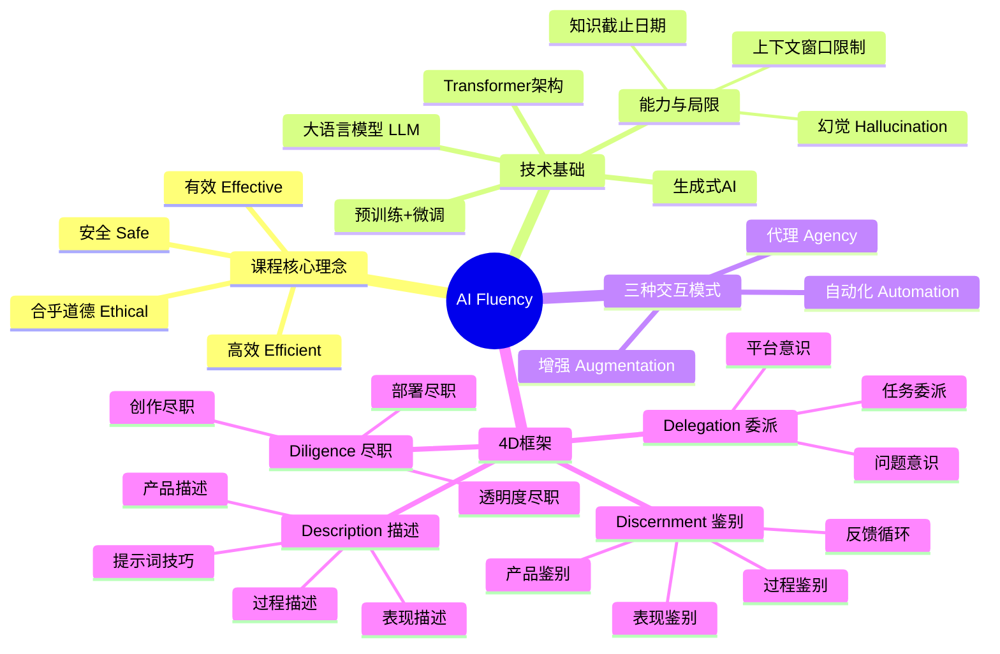

# AI Fluency 框架与基础课程 - 思维导图

> 来源：Anthropic 官方 AI Fluency: Framework & Foundations Course (12节视频)

## Mermaid 思维导图

## 详细层级结构

- **AI 流利度框架与基础课程 (AI Fluency Framework & Foundations)**
  - **课程核心理念**
    - **定义**：以有效 (Effective)、高效 (Efficient)、合乎道德 (Ethical) 和安全 (Safe) 的方式与 AI 系统互动的能力
    - **目标**：不将 AI 仅仅视为工具或拼写检查器，而是视为值得信赖的合作伙伴
    - **转变**：从单纯的技术操作（如提示词工程）转向发展核心能力和思维方式
  - **技术基础：生成式 AI (Generative AI)**
    - **定义**：创造新内容而非仅仅分析现有数据的 AI 系统
    - **核心技术**：大型语言模型 (LLMs)，基于 Transformer 架构
    - **发展要素**：算法突破、海量数据、计算能力 (Scaling Laws)
    - **工作原理**
      - **预训练 (Pre-training)**：分析海量文本模式，建立语言和知识地图
      - **微调 (Fine-tuning)**：通过人类反馈和强化学习，学习遵循指令及安全规范
      - **概率预测**：基于统计模式预测下一个文本，具有非确定性 (Non-deterministic)
    - **能力与局限**
      - **优势**：多功能性 (Versatility)、语境学习 (In-context learning)、涌现能力
      - **局限性**
        - 知识截止日期 (Knowledge Cutoff)
        - 幻觉 (Hallucinations)：自信地生成错误信息
        - 上下文窗口限制 (Context Window)：一次能处理的信息量有限
        - 推理能力：处理复杂多步骤逻辑时可能出错（虽在改进中）
  - **人机交互的三种模式**
    - **自动化 (Automation)**：AI 根据指令完成特定任务（如写摘要）
    - **增强 (Augmentation)**：人类与 AI 协作，作为思维伙伴共同解决问题
    - **代理 (Agency)**：设定愿景，AI 独立代表人类行动
  - **4D 核心能力框架 (The 4D Framework)**
    - **1. 委派 (Delegation)**
      - **核心关注**：有效性与效率，决定什么工作由谁做
      - **问题意识 (Problem Awareness)**：明确目标、愿景以及所需的思考类型
      - **平台意识 (Platform Awareness)**：了解不同 AI 系统的优势与局限
      - **任务委派 (Task Delegation)**：策略性地分配工作给人类或 AI
        - 自动化、增强、代理或完全由人类完成
    - **2. 描述 (Description)**
      - **核心关注**：清晰沟通，作为意图与 AI 能力之间的桥梁
      - **产品描述 (Product Description)**：定义想要创造什么（格式、受众、内容）
      - **过程描述 (Process Description)**：指导 AI 如何处理任务（步骤、方法、参考数据）
      - **表现描述 (Performance Description)**：定义 AI 的行为方式（语气、角色、风格）
      - **实战技巧：提示词工程 (Prompting Techniques)**
        - 提供背景信息 (Context)
        - 展示示例 (Show examples/Few-shot)
        - 设定输出约束 (Output constraints)
        - 拆分复杂任务 (Break tasks into steps)
        - 让 AI 先思考 (Ask Claude to think first)
        - 定义角色与风格 (Define role/persona)
        - 让 AI 帮助优化提示词 (Meta-prompting)
    - **3. 鉴别 (Discernment)**
      - **核心关注**：评估与质量控制，判断输出是否满足需求
      - **产品鉴别 (Product Discernment)**：评估输出的准确性、连贯性和价值
      - **过程鉴别 (Process Discernment)**：评估 AI 的推理逻辑和处理步骤是否合理
      - **表现鉴别 (Performance Discernment)**：评估交互质量（如沟通是否高效）
      - **反馈循环**：发现问题后，通过改进"描述"来修正结果
    - **4. 尽职 (Diligence)**
      - **核心关注**：道德与安全，对交互负责
      - **创作尽职 (Creation Diligence)**：审慎选择 AI 系统，注意数据隐私和合规性
      - **透明度尽职 (Transparency Diligence)**：诚实披露 AI 在工作中的角色
      - **部署尽职 (Deployment Diligence)**：对 AI 生成内容的准确性和影响承担最终责任
  - **总结与未来**
    - **持续学习**：通过实践（迭代循环）掌握 4D 能力
    - **人类责任**：利用人类的判断力、创造力和道德监督补充 AI 的不足
    - **核心目标**：实现有效、高效、合乎道德且安全的人机协作

## 10个实用提示词技巧

1. **提供丰富的上下文背景** - 说明你想要什么、为什么、你的具体情况
2. **提供"好"的示例 (Few-shot)** - 展示期望的输出样本
3. **明确输出约束和格式** - 指定格式、长度、风格
4. **将复杂任务拆解为步骤** - 思维链提示 (Chain of thought)
5. **要求AI先思考再行动** - 展示思考过程后再给答案
6. **定义角色、风格或语气** - 指定AI应扮演的角色
7. **让AI帮你优化提示词** - Meta-prompting
8. **描述过程而非仅仅是结果** - 像给同事提供"食谱"
9. **迭代与尝试变体** - 每次互动是改进的反馈
10. **像对待新同事一样沟通** - 给出背景、示例和工作步骤

---

*Generated by NotebookLM + Claude Code on 2026-01-20*
