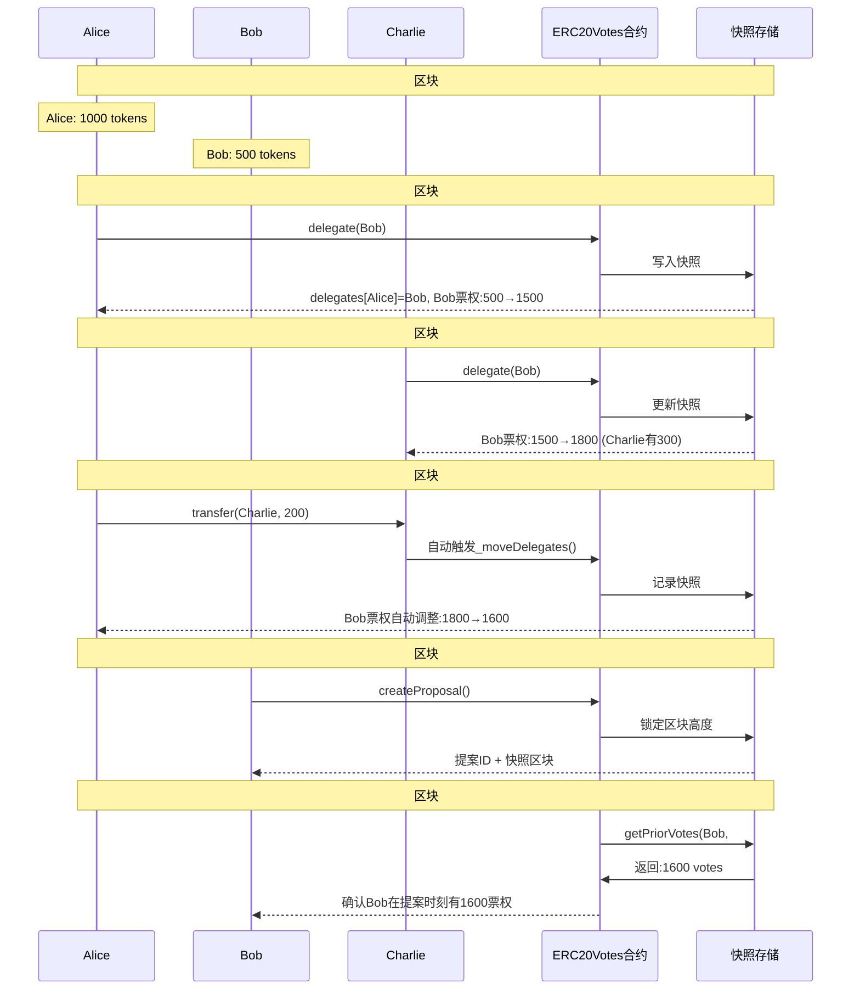

# ERC20Votes 投票权变化时序图

## 方案一：Mermaid 图表（推荐）



## 方案二：ASCII 艺术时序图

```text
Alice    Bob     Charlie  ERC20Votes  快照存储
|       |         |         |         |
|       |         |         |         |  区块#1000 初始状态
|
----delegate(Bob)----->|
|       |         |         |
|       ----> 写入快照 ---->
|<---delegates[Alice]=Bob---|
-----|  Bob票权:500→1500

|       |         |         |         |  区块#1001
|       |    delegate(Bob)  |         |
|       |--------- --------->|         |
|       |         ----> 更新快照 ---->
|       |         |<----- Bob票权1800 ---|  (Charlie有300)

|       |         |         |         |  区块#1002
|---transfer(Charlie,200)-->|         |
|       |         ----> 自动_moveDelegates()
|       |         ----> 记录快照 ---->
|<---Bob票权调整1600------|

|       |         |         |         |  区块#1003
|       |createProposal()   |         |
|       |------------------>|         |
|       |         ----> 锁定区块高度 ---->
|       |<---提案ID+快照------|

|       |         |         |         |  区块#1004
|       |         |  getPriorVotes()  |
|       |         |-------->|         |
|       |         |         |<-- 返回1600
|       |<---确认1600票权-----|
```

## 方案三：分步骤文字描述

### 步骤1: 初始状态 (区块 #1000)

- **状态**: Alice: 1000 tokens, Bob: 500 tokens
- **投票权**: 各自拥有对应数量的投票权

### 步骤2: Alice委托 (区块 #1001)

- **操作**: `Alice → ERC20Votes: delegate(Bob)`
- **内部**: `ERC20Votes → 快照存储: 写入快照`
- **结果**: `delegates[Alice] = Bob, Bob票权: 500 → 1500`

### 步骤3: Charlie委托 (区块 #1002)

- **操作**: `Charlie → ERC20Votes: delegate(Bob)`
- **内部**: `ERC20Votes → 快照存储: 更新快照`
- **结果**: `Bob票权: 1500 → 1800` (假设Charlie有300)

### 步骤4: Alice转账 (区块 #1003)

- **操作**: `Alice → Charlie: transfer(200)`
- **触发**: `自动调用 _moveDelegates()`
- **内部**: `ERC20Votes → 快照存储: 记录快照`
- **结果**: `Bob票权自动调整: 1800 → 1600`

### 步骤5: 创建提案 (区块 #1004)

- **操作**: `Bob → ERC20Votes: createProposal()`
- **内部**: `ERC20Votes → 快照存储: 锁定区块高度`
- **结果**: `提案创建 + 快照区块 #1004`

### 步骤6: 查询历史投票权 (区块 #1005)

- **查询**: `ERC20Votes → 快照存储: getPriorVotes(Bob, #1004)`
- **返回**: `快照存储 → ERC20Votes: 1600 votes`
- **确认**: `Bob在提案时刻拥有1600票权`

## 快照存储示例

```text
Bob的投票权历史:
├── Block #1000: 500 votes (初始)
├── Block #1001: 1500 votes ← Alice委托
├── Block #1002: 1800 votes ← Charlie委托
├── Block #1003: 1600 votes ← Alice转账
└── Block #1004: 1600 votes ⭐ 提案快照基准
```

## 核心机制总结

- **委托调用**: `delegate()` → 更新委托映射 → 自动重算票权 → 写入快照
- **转账触发**: `transfer()` → `_moveDelegates()` → 自动调整委托人票权 → 记录快照
- **提案创建**: `createProposal()` → 锁定当前区块高度作为投票权快照基准
- **历史查询**: `getPriorVotes(地址, 区块)` → 二分搜索快照数组 → 返回历史权重
- 提案创建时记录区块高度，投票时只能使用该区块高度权重，防止"先投票后转账"操控。

## 使用建议

- 在 Logseq 中推荐使用**方案一的 Mermaid 图表**。
- 如果 Mermaid 不支持，可使用**方案三的分步骤描述** + 表格/快照补充。
- ASCII 图表适合快速草图和代码注释。
