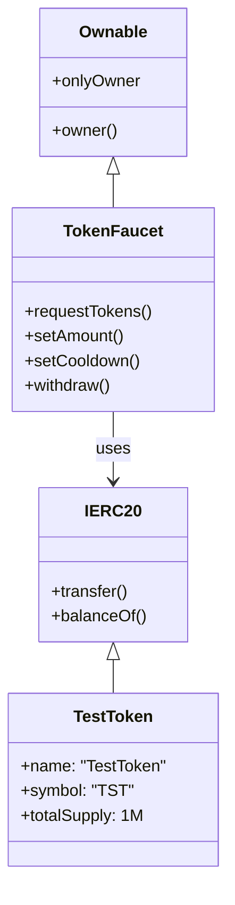
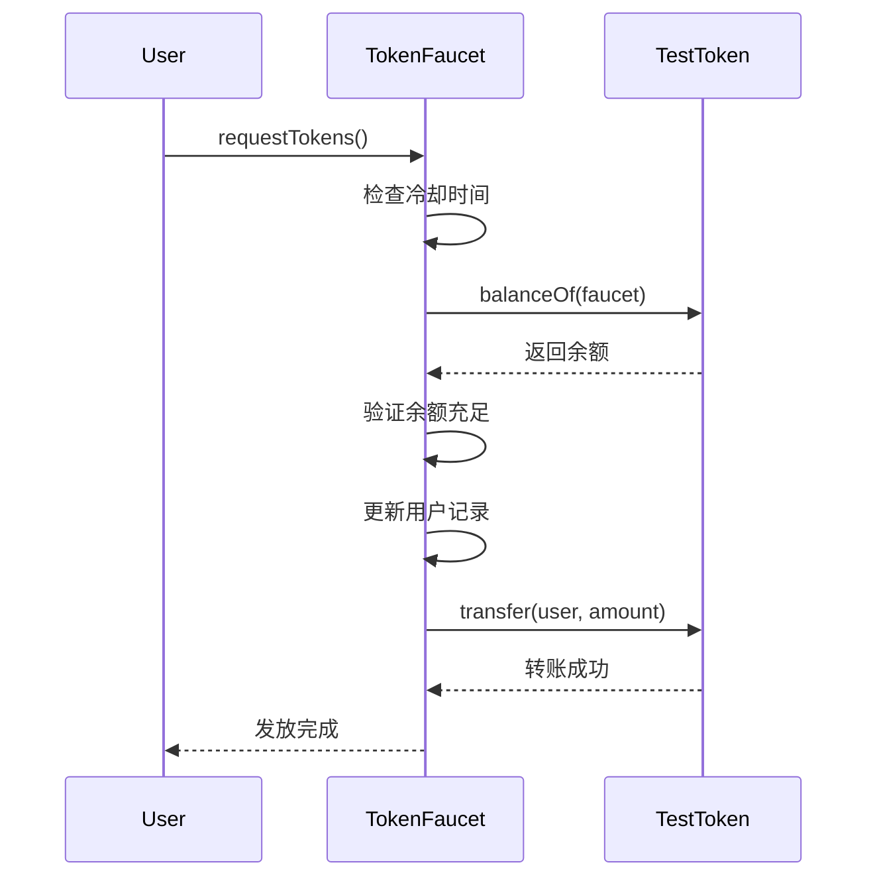
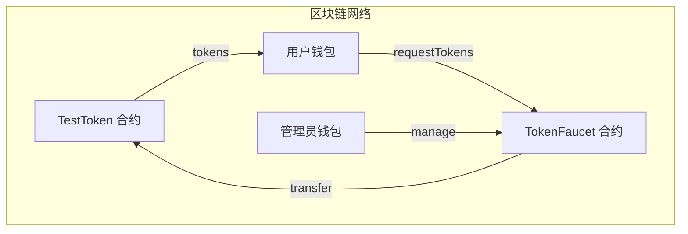

# ERC20 Faucet 项目 - 4+1 架构视图

## 项目概述

一个基于 Solidity 的 [[ERC-20 同质化代币标准]] 代币水龙头系统，允许用户定期领取测试代币，包含代币合约和 [[代币水龙头]] 发放机制。

## 1. 逻辑视图（Logical View）

### 核心组件

- TestToken：标准 ERC20 代币实现，基于 [[OpenZeppelin库]]，总供应量 1,000,000 TST，部署时分配给部署者
- TokenFaucet：水龙头核心逻辑，含冷却时间管理、权限控制、重入攻击防护

### 接口关系



## 2. 进程视图（Process View）

### 用户领取流程



### 管理员操作流程

管理员设置 → 权限验证 → 参数更新 → 事件记录

### 并发控制

- 重入攻击防护：`_locked` 状态控制
- 冷却时间控制：`lastRequestTime` mapping
- 原子性操作：[[CEI模式]]

## 3. 开发视图（Development View）

### 项目结构

```
ERC20Faucet/
├── src/
│   ├── TestToken.sol      # ERC20 代币合约
│   └── TokenFaucet.sol    # 水龙头合约
├── test/
│   └── TokenFaucet.t.sol  # 测试套件
├── script/
│   └── Deploy.s.sol       # 部署脚本
└── foundry.toml           # 配置文件
```

### 依赖关系

- OpenZeppelin Contracts：`@openzeppelin/contracts/token/ERC20/IERC20.sol`、`@openzeppelin/contracts/access/Ownable.sol`
- Foundry Framework：`forge-std/Test.sol`、`forge-std/Script.sol`

### 代码组织

- 安全模块：重入防护、权限控制
- 核心逻辑：代币发放、冷却管理
- 工具函数：查询接口、管理接口

## 4. 物理视图（Physical View）

### 部署架构



### 网络配置

- 本地开发：Anvil 本地节点
- 测试网：Sepolia/Goerli
- 主网：Ethereum Mainnet

### 资源要求

Gas 消耗：
- `requestTokens()`：~50,000 gas
- `setAmount()`：~30,000 gas
- `withdraw()`：~40,000 gas

存储需求：
- 用户记录：mapping 存储
- 合约状态：最小化存储

## 5. 场景视图（Use Case View）

### 主要用例

- UC1：用户领取代币 — 前置条件：用户已过冷却期，水龙头有余额；主流程：检查→验证→发放→记录；后置条件：用户获得代币，冷却时间重置
- UC2：管理员设置参数 — 前置条件：调用者是合约 owner；主流程：验证权限→更新参数→发出事件；后置条件：参数更新生效
- UC3：管理员提取代币 — 前置条件：合约有余额，调用者是 owner；主流程：验证→转账→记录；后置条件：代币转移到管理员账户

### 异常场景

- 冷却时间未到：抛出 `CooldownNotExpired` 错误
- 余额不足：抛出 `InsufficientFaucetBalance` 错误
- 权限不足：抛出 `Ownable: caller is not the owner` 错误

### 性能需求

- 响应时间：交易确认 < 15秒（取决于网络）
- 并发用户：支持大量用户同时请求
- 可用性：7×24 小时可用

## 技术特性

### 安全机制

重入攻击防护（手动实现的重入锁）：

```solidity
bool private _locked;
modifier nonReentrant() {
    require(!_locked, "ReentrancyGuard: reentrant call");
    _locked = true;
    _;
    _locked = false;
}
```

权限控制：
- 基于 OpenZeppelin Ownable
- 关键函数仅 owner 可调用

输入验证：
- 参数有效性检查
- 边界条件处理

### 错误处理

自定义错误：
- `CooldownNotExpired(uint256 remainingTime)`
- `InsufficientFaucetBalance()`
- `InvalidAmount()`

错误恢复：状态回滚，清晰的错误信息

## 部署与运维

### 部署流程

```bash
# 1. 环境准备
forge install OpenZeppelin/openzeppelin-contracts

# 2. 编译测试
forge build
forge test

# 3. 部署
forge script script/Deploy.s.sol --broadcast
```

### 监控指标

- 水龙头余额
- 每日发放量
- 用户活跃度
- 错误率统计

### 维护操作

- 定期补充代币
- 参数调优
- 安全审计

## 扩展性考虑

功能扩展：
- 多种代币支持
- 差异化发放策略
- 用户等级系统

性能优化：
- Gas 优化
- 批量操作支持
- 状态压缩

集成接口：
- Web3 前端集成
- API 接口封装
- 第三方钱包支持
