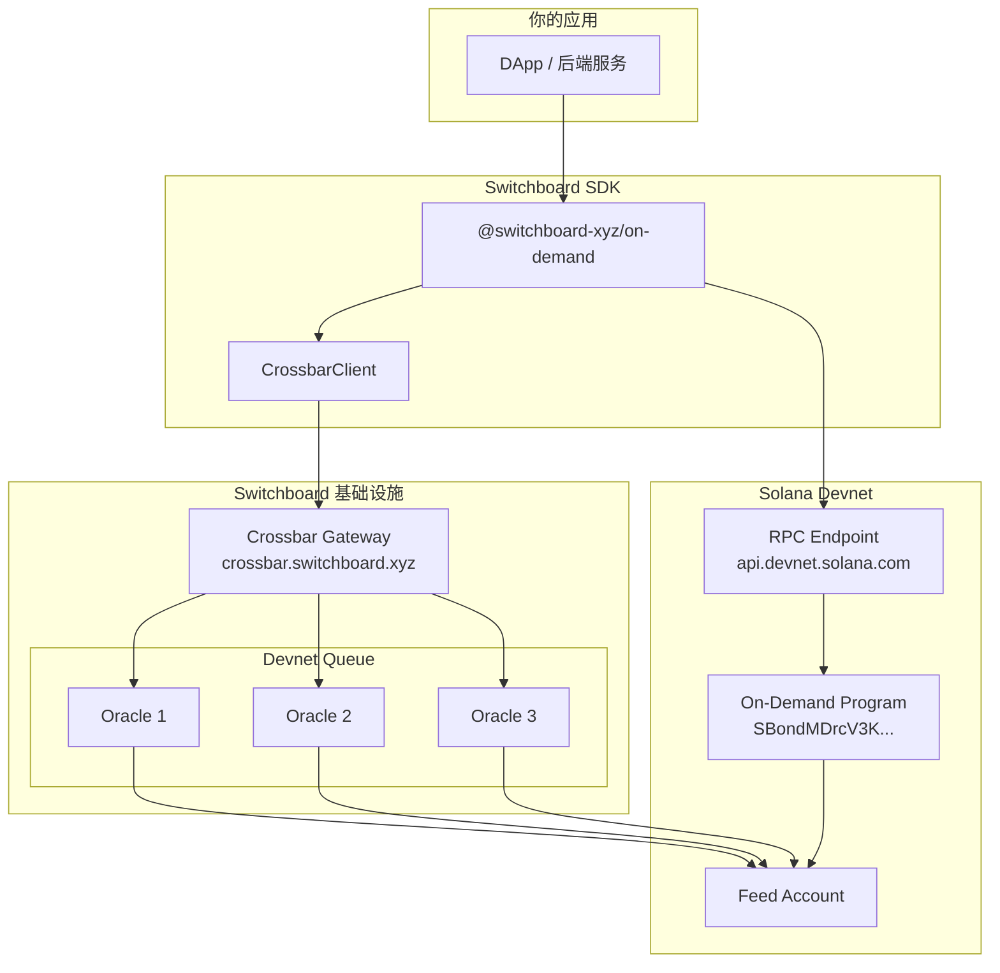
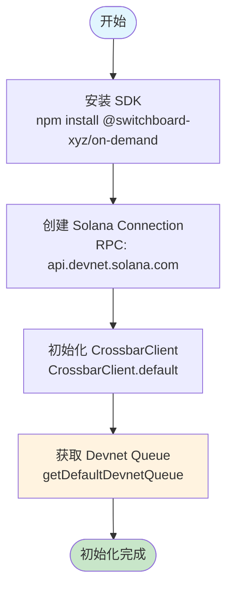
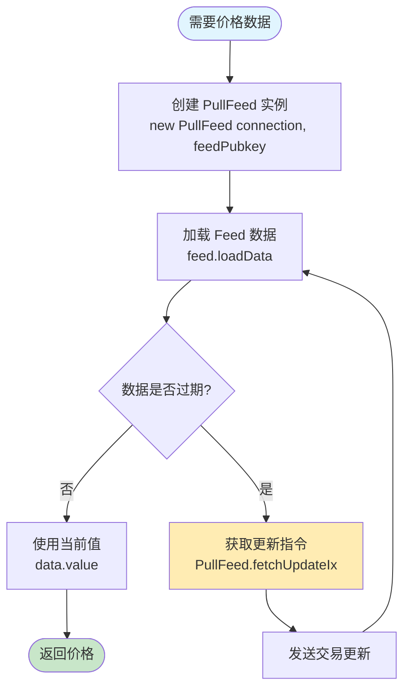
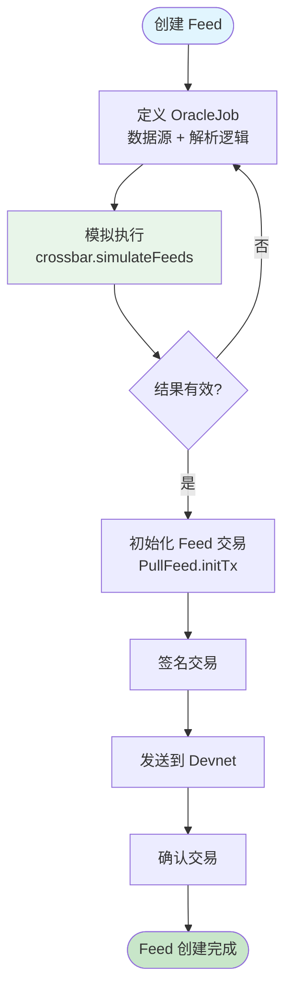
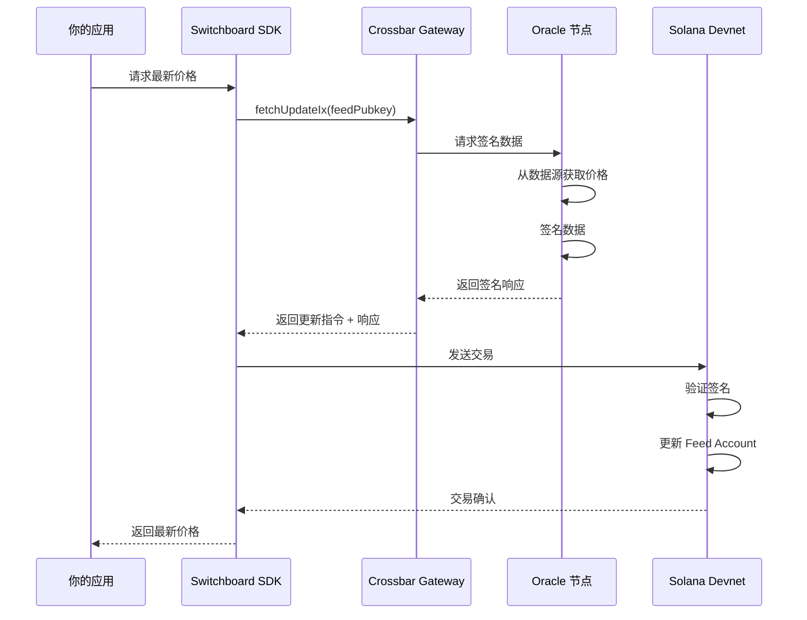
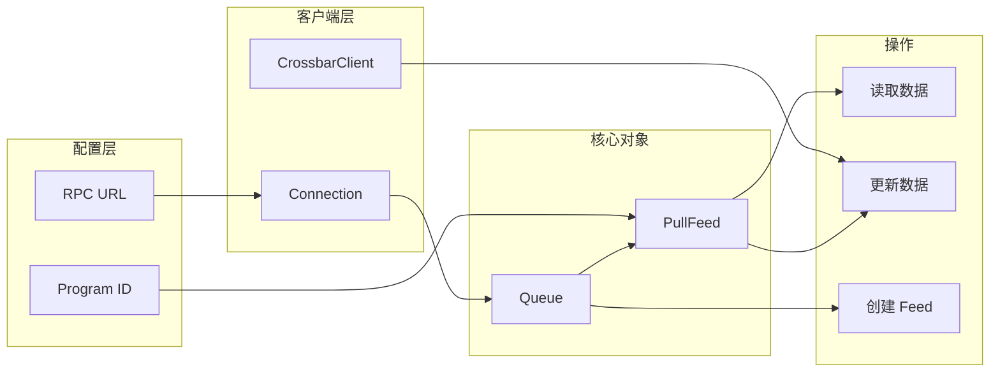
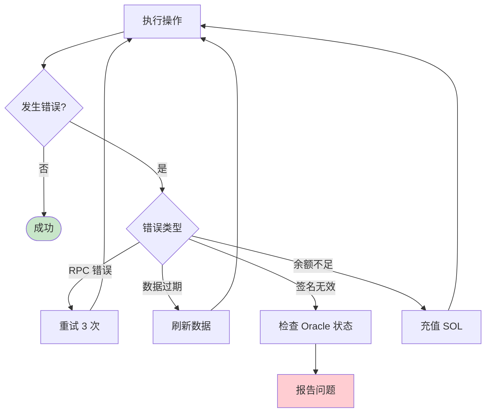

# Switchboard Devnet 使用流程图

## 1. 整体架构

## 2. 初始化流程

## 3. 读取 Feed 数据流程

## 4. 创建自定义 Feed 流程

## 5. 数据更新流程 (Pull Oracle)

## 6. 关键组件关系

## 7. 代码与流程对照

| 流程步骤 | 代码 | 说明 |
|---------|------|------|
| 建立连接 | `new Connection(RPC_URL)` | 连接 Solana Devnet |
| 初始化网关 | `CrossbarClient.default()` | 连接 Crossbar |
| 获取队列 | `getDefaultDevnetQueue(rpcUrl)` | 获取 Devnet Oracle 队列 |
| 创建 Feed | `new PullFeed(conn, pubkey)` | 实例化 Feed 对象 |
| 读取数据 | `feed.loadData()` | 从链上读取 |
| 更新数据 | `PullFeed.fetchUpdateIx()` | 获取更新指令 |

## 8. 错误处理流程

